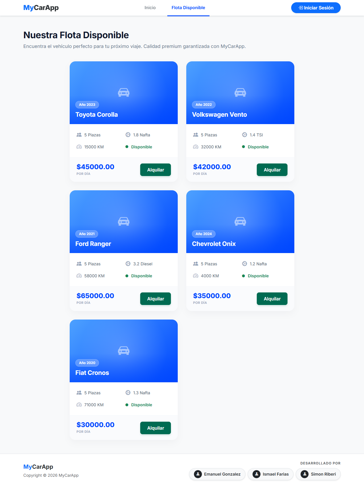
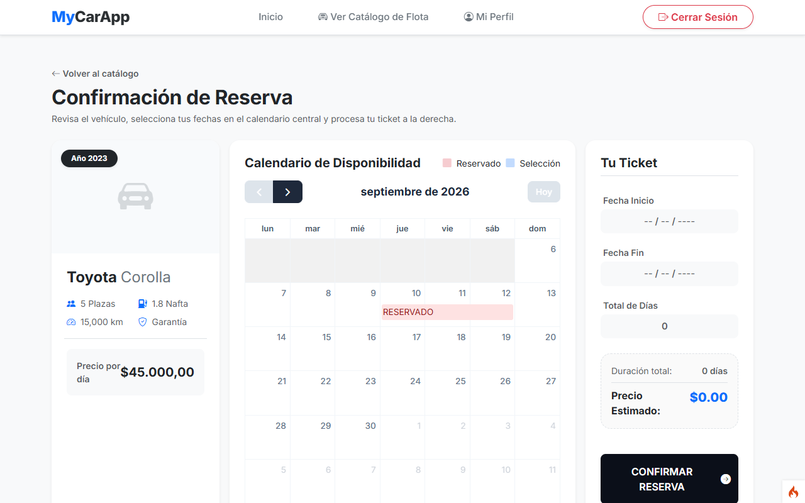
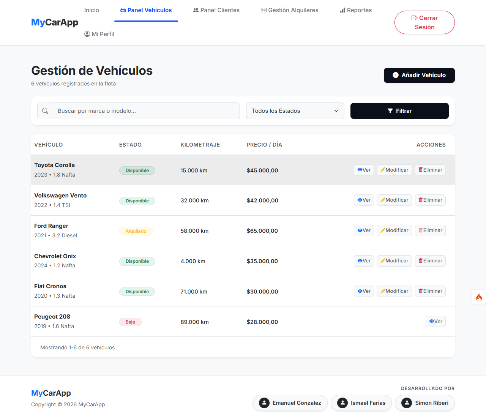
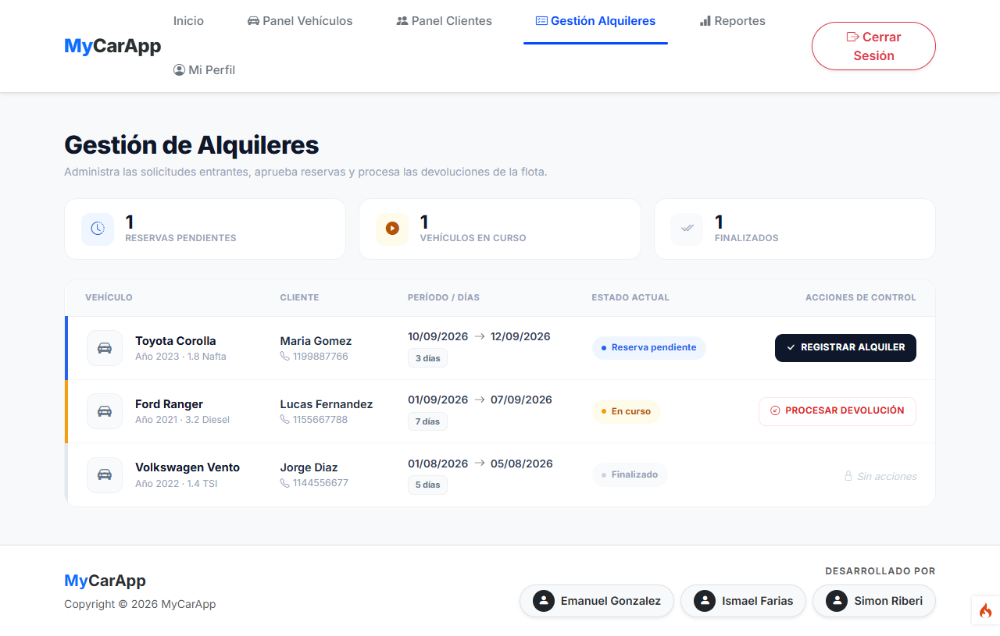
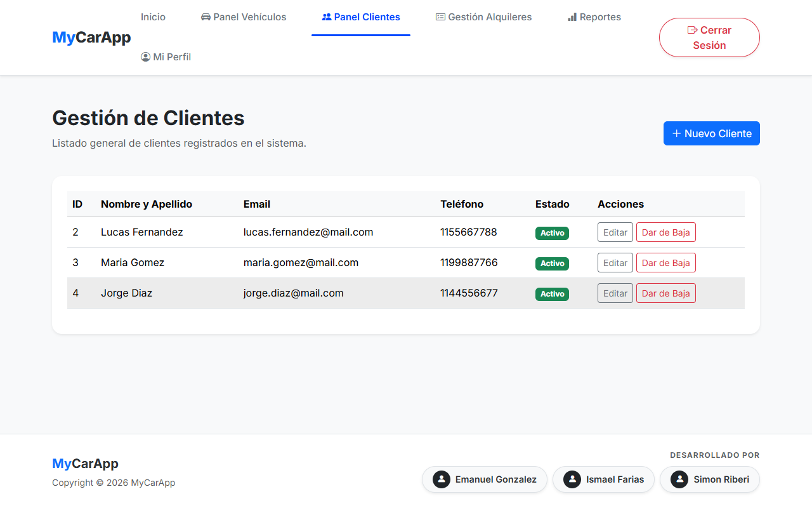
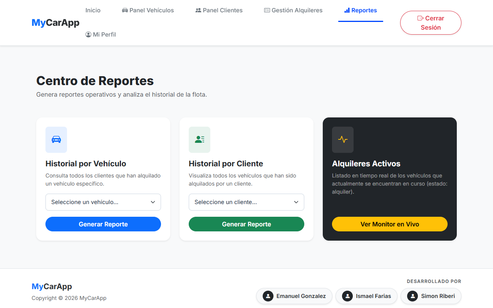
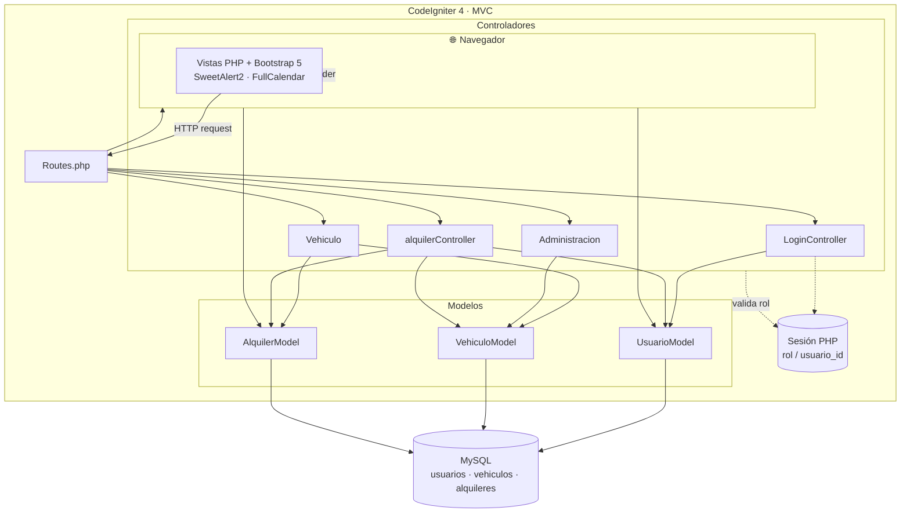
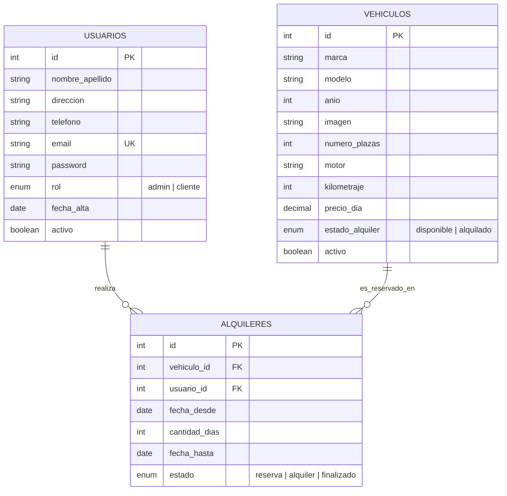

# 🚗 MyCarApp — Sistema de Alquiler de Vehículos


Aplicación web full-stack para la gestión integral de un negocio de alquiler de vehículos: catálogo público, reservas con calendario de disponibilidad, panel de administración con ABM de flota y clientes, flujo de aprobación/devolución de alquileres, y un dashboard de reportes.

## 📌 Propósito

Este proyecto fue desarrollado como trabajo práctico universitario, con el objetivo de aprender y aplicar PHP y CodeIgniter 4 con el patrón MVC de punta a punta: modelos con reglas de validación nativas del framework, controladores separados por rol (administrador / cliente), autenticación por sesión, y vistas dinámicas con Bootstrap 5 y JavaScript (SweetAlert2, FullCalendar).

## ✨ Funcionalidades

**Autenticación y usuarios**
- Registro de clientes y login con contraseñas hasheadas (`password_hash` / `password_verify`).
- Sesiones con control de rol (`admin` / `cliente`) para restringir vistas y acciones.
- Edición de perfil propio (datos personales y cambio de contraseña).

**Catálogo y reservas (cliente)**
- Listado público de vehículos disponibles, con foto, precio por día y ficha técnica.
- Calendario de disponibilidad por vehículo (FullCalendar) que marca los días ya reservados.
- Formulario de reserva con validación de fechas en servidor, evitando el solapamiento aunque el calendario del cliente sea manipulado.

**Panel de administración**
- ABM de vehículos: alta, edición, baja lógica y carga de imagen con validación de tipo/tamaño.
- Búsqueda y filtrado de flota por marca/modelo y por estado (disponible, alquilado, dado de baja).
- ABM de clientes, con bloqueo de baja si el cliente tiene un alquiler activo.
- Gestión de alquileres: aprobación de reservas (pasan a "alquiler activo") y procesamiento de devoluciones, con bloqueo de devolución anticipada a la fecha pactada.

**Reportes**
- Dashboard de reportes con listados por vehículo, por cliente, y de alquileres actualmente en curso (consultas con `JOIN` entre `alquileres`, `vehiculos` y `usuarios`).

## 📸 Capturas de pantalla

| Catálogo público | Reserva con calendario |
|---|---|
|  |  |

| Gestión de vehículos (admin) | Gestión de alquileres (admin) |
|---|---|
|  |  |

| Panel de clientes (admin) | Dashboard de reportes |
|---|---|
|  |  |

## 🏗️ Diagrama de arquitectura

> Los diagramas Mermaid se renderizan automáticamente en GitHub. Si los ves como texto plano, abrí este archivo en GitHub o en un editor compatible (VS Code con la extensión Mermaid, por ejemplo).



## 🗂️ Diagrama entidad-relación



## 🛠️ Stack técnico

| Capa | Tecnología |
|---|---|
| Backend | PHP 8.2+, [CodeIgniter 4](https://codeigniter.com/) (MVC) |
| Base de datos | MySQL, acceso vía Query Builder de CodeIgniter |
| Frontend | Bootstrap 5.3, Bootstrap Icons, JavaScript vanilla |
| Librerías JS (CDN) | SweetAlert2 (alertas), FullCalendar (calendario de disponibilidad) |
| Autenticación | Sesiones nativas de PHP + `password_hash` / `password_verify` |
| Testing | PHPUnit 10 |
| Gestión de dependencias | Composer |

## 📁 Estructura de carpetas

```
MyCarAppCI4/
├── app/
│   ├── Config/           # Rutas, base de datos, filtros, app.php
│   ├── Controllers/      # Login, Cliente, Vehiculo, Administracion, Alquiler
│   ├── Models/           # UsuarioModel, VehiculoModel, AlquilerModel
│   ├── Views/
│   │   ├── Vistas_de_autenticacion/   # Login
│   │   ├── Vistas_de_cliente/         # Catálogo, reserva, perfil
│   │   ├── Vistas_de_administrador/   # ABM vehículos, clientes, reportes
│   │   └── templates/                 # Layout base
│   ├── Database/
│   │   ├── Migrations/   # (vacío en este repo, ver Limitaciones)
│   │   └── Seeds/
│   └── Filters/
├── public/
│   ├── assets/{css,js,images}
│   └── index.php         # Punto de entrada
├── tests/                # PHPUnit
└── spark                 # CLI de CodeIgniter
```

## 🚀 Instalación

**Requisitos**: PHP ≥ 8.2 con extensiones `intl` y `mbstring`, Composer, MySQL.

```bash
git clone https://github.com/<tu-usuario>/MyCarAppCI4.git
cd MyCarAppCI4
composer install
```

1. Copiá el archivo de entorno de ejemplo y ajustalo:
   ```bash
   cp env .env
   ```
   Configurá al menos `app.baseURL` y las credenciales de `database.default.*`.

2. Este repo no incluye migraciones ni un dump SQL. Creá manualmente la base de datos y las tablas con el siguiente esquema (inferido de los modelos):

   ```sql
   CREATE DATABASE mycar_db CHARACTER SET utf8mb4;
   USE mycar_db;

   CREATE TABLE usuarios (
       id INT AUTO_INCREMENT PRIMARY KEY,
       nombre_apellido VARCHAR(100) NOT NULL,
       direccion VARCHAR(150),
       telefono VARCHAR(20),
       email VARCHAR(150) NOT NULL UNIQUE,
       password VARCHAR(255) NOT NULL,
       rol ENUM('admin','cliente') NOT NULL,
       fecha_alta DATE NOT NULL,
       activo TINYINT(1) NOT NULL DEFAULT 1
   );

   CREATE TABLE vehiculos (
       id INT AUTO_INCREMENT PRIMARY KEY,
       marca VARCHAR(50) NOT NULL,
       modelo VARCHAR(50) NOT NULL,
       anio INT NOT NULL,
       imagen VARCHAR(255),
       numero_plazas INT NOT NULL,
       motor VARCHAR(100) NOT NULL,
       kilometraje INT NOT NULL,
       precio_dia DECIMAL(10,2) NOT NULL,
       estado_alquiler ENUM('disponible','alquilado') NOT NULL DEFAULT 'disponible',
       activo TINYINT(1) NOT NULL DEFAULT 1
   );

   CREATE TABLE alquileres (
       id INT AUTO_INCREMENT PRIMARY KEY,
       vehiculo_id INT NOT NULL,
       usuario_id INT NOT NULL,
       fecha_desde DATE NOT NULL,
       cantidad_dias INT NOT NULL,
       fecha_hasta DATE NOT NULL,
       estado ENUM('reserva','alquiler','finalizado') NOT NULL DEFAULT 'reserva',
       FOREIGN KEY (vehiculo_id) REFERENCES vehiculos(id),
       FOREIGN KEY (usuario_id) REFERENCES usuarios(id)
   );

   Generá el hash de una contraseña de prueba para el usuario admin (necesario porque el login usa `password_verify`):
   ```bash
   php -r "echo password_hash('admin123', PASSWORD_DEFAULT), PHP_EOL;"
   ```
   Con el hash resultante, insertá el usuario admin:
   ```sql
   INSERT INTO usuarios (nombre_apellido, email, password, rol, fecha_alta, activo)
   VALUES ('Administrador', 'admin@mycar.com', '<hash generado arriba>', 'admin', CURDATE(), 1);
   ```

3. Levantá el servidor de desarrollo:
   ```bash
   php spark serve
   ```
   La app queda disponible en `http://localhost:8080`.

## ⚠️ Limitaciones conocidas

Este proyecto fue un ejercicio de aprendizaje, no un sistema en producción:

- **Credenciales hardcodeadas**: usuario/contraseña de MySQL y `baseURL` escritos directamente en `app/Config/Database.php` y `App.php` en vez de leerse desde `.env`.
- **CSRF deshabilitado**: el filtro `csrf` existe pero está comentado en `$globals` de `Filters.php`.
- **Fallback de contraseña en texto plano** en `LoginController::autenticar()` (`$password === $pass`), resabio de una carga de usuarios sin hashear.
- **Autorización repetida a mano** (`session()->get('rol')`) en cada método de cada controlador, en vez de un filtro centralizado.
- **Sin migraciones, seeds ni tests** sobre la lógica de negocio.

## 📄 Licencia

Este proyecto se distribuye bajo licencia MIT (heredada del starter de CodeIgniter 4). Ver [LICENSE](LICENSE).
